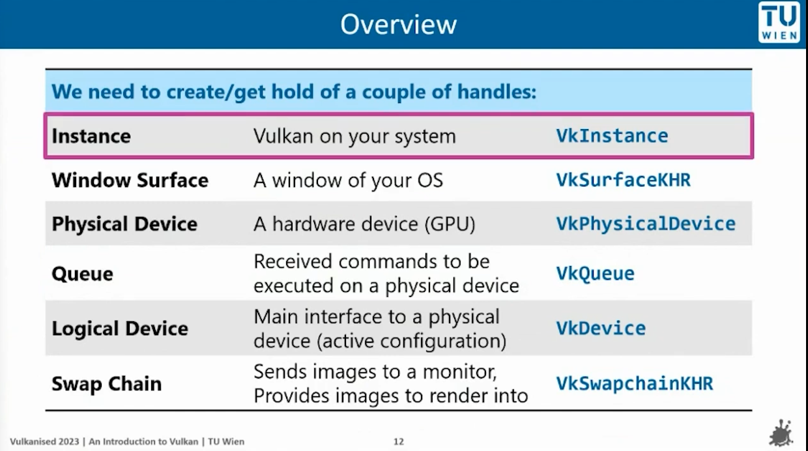
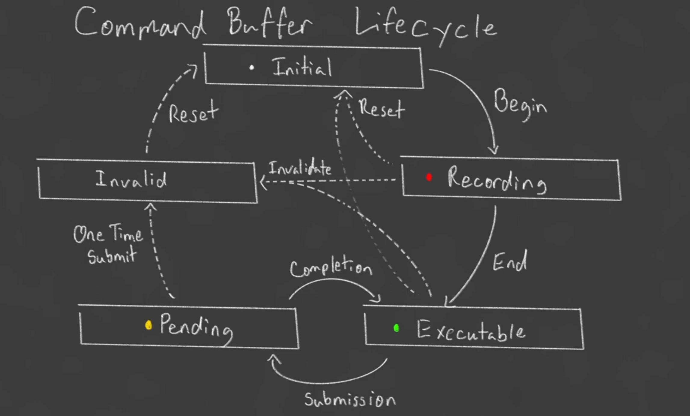

[chapter 1  code](https://github.com/junyiwuu/vulkanEngine/tree/00a8953686fdff02c80504df77a1088ce2ec82bf)

[Vulkan Engine tutorial](https://youtube.com/playlist?list=PL8327DO66nu9qYVKLDmdLW_84-yE4auCR&si=RmYj1OuZB_rt8zqs)

### Overview notes:

FirstApp : initialize the window, initialize the graphicPipeline(read SPRV files into buffers)


  




  
  
  
  

## Chapter 2 : read spv and build pipeline

[chapter 2 code](https://github.com/junyiwuu/vulkanEngine/tree/b54ca5d99010c94e903fa41f704188dc7adc9ae1)

----------------------------

 
pipeline build

std::vector
dynamic sized array

  

`static std::vector<char> readFile(const std::string& filepath);` read file content and return with formate std::vector\<char>

  

  

## createGraphicPipeline

we read files into buffers.
```cpp
auto vertCode = readFile(vertFilepath);
auto fragCode = readFile(fragFilepath);
```


**lvePipeline constructor**

call createGraphicPiline function --> create buffers --> read files for buffers, store data into them.

  
  
  

**back to FirstApp**:

```cpp

namespace lve{

class FirstApp{
  public:
	static constexpr int width = 800;
	static constexpr int height = 600;
	

	void run();

   private:
		LveWindow LveWindow_app{width , height, "hello vulkan"} ;
		lvePipeline lvePipeline_app{"../shaders/simple_shader.vert.spv", "../shaders/simple_shader.frag.spv"};
};

}

```

add the lvePipeline in FirstApp private, so when initialize the object, it also get called

  

## Chapter 3:

[chapter 3 code](https://github.com/junyiwuu/vulkanEngine/tree/d52a0cd4cf65d366e987f077259bbd2d5749374b)

  
  
  


## Chapter 4:

[chapter 4 code](https://github.com/junyiwuu/vulkanEngine/tree/d282352785ff4ba909beed1d68cbaf0d96b6d935)

  

  

**VkViewport.minDepth:**

define the depth range used during rendering, which maps the clip-space z value (from the projection transformation) to the depth buffer.

  
  
  

**VkPipelineColorBlendStateCreateInfo**

**VkPipelineColorBlendAttachmentState** :

is used to define the blending configuration for a single color attachment.

- A framebuffer can contain multiple color attachments.

- for example when rendering to multiple render targets, each color attachment can have its own independent blending settings

  
  

**Framebuffer attachments**:

a memory location where renderinng pipeline outputs data.

These attachments are typically part of a framebuffer, is used in conjunction with a render pass

- color attachment

- depth attachment

  

Color blending. They are used to configure how graphic pipeline processes the colors of framebuffer attachments during rendering

  

ORDER:

1. VkGraphicsPipelineCreateInfo (top)

2. VkPipelineShaderStageCreateInfo (part of the above)


## Chapter 5:

  

**VkExtent2D**

When you need to create a swap chain or framebuffer, you will need to tell the size

> - It seems like just return width and height, whiy need to use this class?

This ensuresthe code type-safe, it clearly indicates that the returned values are vulkan-compatible dimensions, not arbitray integers

  

**Command Buffer**

`std::vector<VkCommandBuffer> commandBuffers` A container to hold Vulkan Command Buffers.

A command buffer that contains many functions, we call this command buffer, to execute bunch of functions

  

Record commands buffers once at initialization and the reuse for each frame.

  
  
  
  
  
  

Command Buffer lifecycle from the [tutorial](https://www.youtube.com/watch?v=_VOR6q3edig):

  



  
  

LOGIC:
